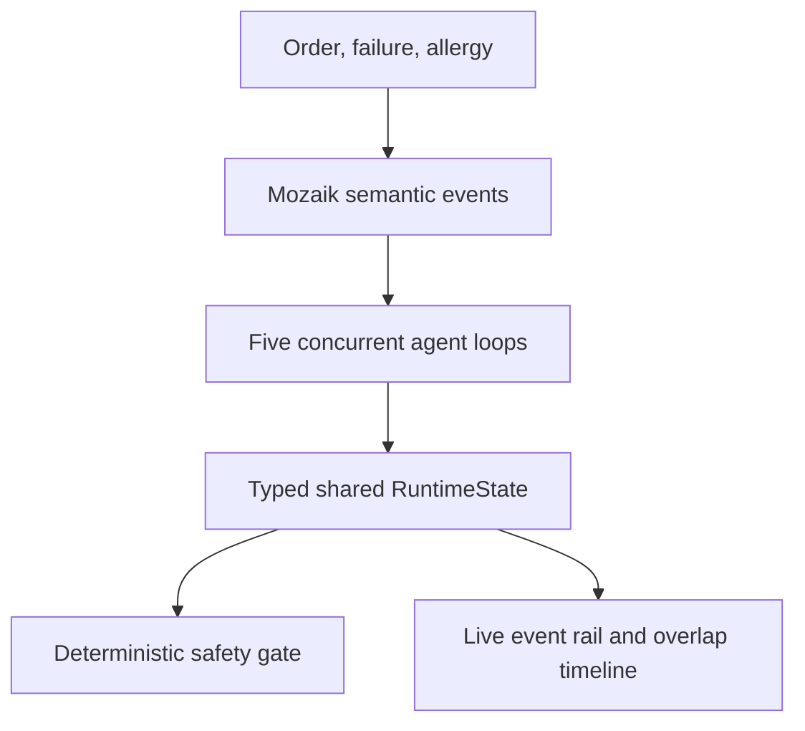

# Dinner Rush

Five AI kitchen agents run one restaurant together. When an order arrives, equipment fails, or an allergy note appears, the relevant agents react at the same time through one shared Mozaik runtime.

> One kitchen. Five autonomous stations. No central scheduler.

## What it does

Dinner Rush turns concurrent agent coordination into a situation anyone can understand: a restaurant during its busiest service.

- **Prep Agent** handles cold prep and emergency rerouting.
- **Grill Agent** cooks hot-line components.
- **Fryer Agent** manages the fryer and reports equipment blocks.
- **Pantry Agent** watches inventory and performs an independent allergy check.
- **Expo Agent** applies a deterministic safety gate before a table can leave the kitchen.

Open the live kitchen, choose a scenario, and watch multiple Mozaik loop IDs overlap on the timeline. The full scenario fires a table, breaks the fryer while agents are still thinking, then adds a late allergy note. Agents react to the evolving shared state, not to a fixed handoff chain.

## Why Mozaik is the hero

This system depends on Mozaik v4 for the behavior the demo proves:

- `defineRuntime` creates a session with typed `KitchenRuntimeState`.
- `createAgent` joins five independent participants with station-specific tools.
- `SemanticEvent`s fan orders, failures, and allergy updates out to every participant.
- Situation handlers decide which participants react to each new event.
- `runLoop` is fire-and-forget, so inference and tool windows genuinely overlap.
- Every tool mutates the same typed runtime state and publishes another semantic event.
- An observer derives the UI from actual runtime lifecycle events and loop IDs.

The scenario driver only introduces real-world events. It never sequences the agents. Each agent independently decides whether to react through its situation handler.



## Concurrency proof

The dashboard does not animate a prewritten schedule. It listens to Mozaik lifecycle events:

1. `message_received.started` opens a bar using the runtime-provided `loopId`.
2. `model.answer` closes that agent's oldest open loop.
3. Start and finish timestamps calculate the visible overlap and peak concurrency.
4. Integration tests require at least five overlapping loops in the full scenario.

The per-station trigger queues also preserve causality when the same agent has several loops in flight. An original ticket cannot accidentally become a later equipment-failure response just because shared state changed while it was thinking.

## Safe demo modes

Dinner Rush has two honest runtime modes:

- **OpenAI live:** Set `OPENAI_API_KEY`. Mozaik uses its bundled OpenAI provider and the configured model for concurrent tool decisions.
- **Mozaik demo runner:** With no provider key, a deterministic `InferenceRunner` produces repeatable inference delays and function calls. Agents still use the real Mozaik v4 loop, tools, semantic events, situation handlers, and shared state. The UI labels this mode clearly.

The final table release is always deterministic. No model can bypass missing food or incomplete allergy checks.

## Run locally

```bash
npm install
cp .env.example .env.local
npm run dev
```

Open [http://localhost:3000](http://localhost:3000). Leave `OPENAI_API_KEY` blank for the repeatable demo or add your key privately for live model reasoning. Never commit `.env.local`.

## Verify

```bash
npm test
npm run lint
npm run build
```

## Stack

- Next.js 16 App Router
- React 19 and TypeScript
- Tailwind CSS 4 with a shadcn-compatible component structure
- Mozaik v4 (`@mozaik-ai/core`)
- OpenAI through Mozaik's bundled provider
- Motion and Lucide React

## Project map

```text
app/api/kitchen/run/route.ts       Streaming kitchen run endpoint
app/kitchen/page.tsx               Live simulator
components/kitchen/                Product UI
components/ui/                     shadcn-compatible primitives and landing shell
lib/kitchen/runtime.ts             Participants, handlers, tools, and event fan-out
lib/kitchen/state.ts               Typed shared RuntimeState
lib/kitchen/demo-runner.ts         Repeatable offline inference runner
lib/kitchen/runtime.test.ts        Concurrency and safety integration test
```

## References

- [Mozaik documentation](https://docs.jigjoy.ai/docs)
- [Mozaik concurrent agents](https://docs.jigjoy.ai/docs/concurrent-agents)
- [Mozaik source](https://github.com/jigjoy-ai/mozaik)
- [OpenAI function calling](https://platform.openai.com/docs/guides/function-calling)
